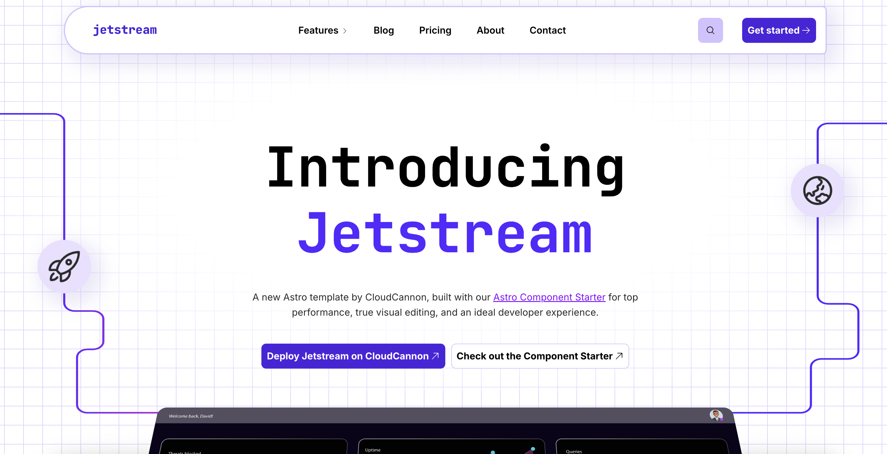

# Jetstream

Jetstream is a polished, high-performance marketing website template for Astro. Browse through a [live demo](https://crawling-submarine.cloudvent.net/).

> [!NOTE]
> This template is built with [Astro 6](https://astro.build/) and the [Astro Component Starter](https://cloudcannon.com/templates/astro-component-starter/).



[](https://app.cloudcannon.com/register#sites/connect/github/cloudcannon/jetstream-astro-template)

## Features

- **Modern Architecture**: Built with Astro for optimal performance and minimal JavaScript
- **Visual Editing**: Visual editing with [CloudCannon](https://cloudcannon.com/) editable regions - edit directly on the pages
- **Component Library**: Reusable, componentized architecture for better maintainability
- **Image Optimization**: Astro's built-in image optimization for all images
- **Accessibility**: Fully accessible navigation and components
- **Design Tokens**: CSS variables for consistent theming
- **Blog System**: Complete blog with pagination and category pages
- **SEO Optimized**: Pre-configured for search engine optimization

## Setup

1. Get a workflow going to see your site's output (with [CloudCannon](https://app.cloudcannon.com/)
   or Astro locally).

### Local Development

Jetstream is built with [Astro](https://astro.build/) and modern CSS for a lean, performant development experience.

```bash
npm install
npm run dev
```

## Site Details

### Tech Stack

- **Astro**: Static site generation with component islands architecture
- **CSS**: Modern CSS with custom properties and cascade layers
- **Lightning CSS**: Fast CSS processing and optimization
- **TypeScript**: Type-safe component development

## Editing

Jetstream features advanced visual editing capabilities with CloudCannon's split configuration, allowing for intuitive content management and real-time preview.

### Visual Editing

- **Live Preview**: See changes instantly as you edit
- **Component-based**: Edit reusable components directly in context
- **Split Configuration**: Modern CloudCannon setup for enhanced editing experience

### Content Management

#### Posts

- Add, update or remove posts in the _Posts_ collection
- Automatic pagination and category organization
- Rich content editing with live preview

#### Site Configuration

- **SEO**: Centralized company information reused across the site
- **Navigation**: Fully accessible, responsive navigation management
- **Footer**: Configurable footer elements and links

## Prerequisites

- Node.js >= 24.0.0

## Updating Dependencies

When adding, removing, or updating packages (on macOS especially), use:

```bash
npm run deps:sync
```

This regenerates `package-lock.json` with resolutions for all target platforms (Linux, Windows, macOS) so CI doesn't break. Plain `npm install` on macOS silently strips Linux-only peer dependencies out of the lockfile, which causes `npm ci` to fail on GitHub Actions.

You can verify the lockfile is CI-ready at any time with:

```bash
npm run deps:check
```

## Learn More

For more details on the component architecture and development workflow, view the [Astro Component Starter README](https://github.com/CloudCannon/astro-component-starter).

## License

MIT
